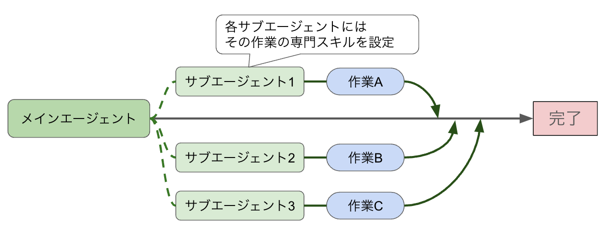
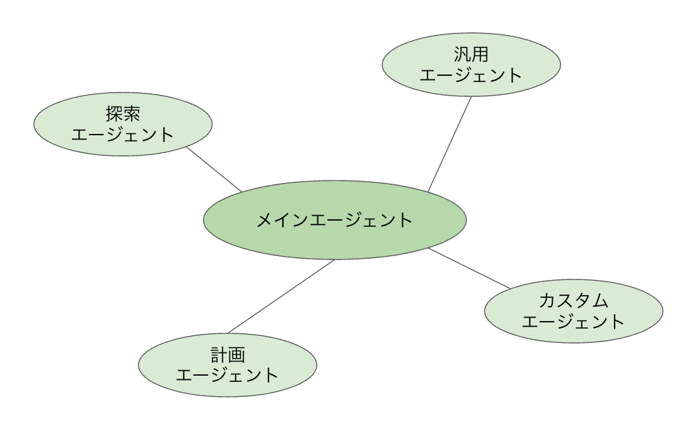

# Claude Codeのサブエージェント機能

## はじめに

前回の記事では、Claude Codeの基本構造として設定ファイルの配置や権限システムを学びました。今回は、Claude Codeをさらに強力にする「サブエージェント機能」について解説します。

Claude Codeに大きなタスクを任せると、AIが自分でタスクを分解し、複数の処理を並列に進めることがあります。その裏側で動いている仕組みが「サブエージェント」です。この機能を理解することで、Claude Codeへの指示の出し方が変わり、より大きな作業を任せられるようになります。また、サブエージェントは自分で定義することもできるため、プロジェクト固有の定型作業を自動化するといった応用も可能です。

## サブエージェントとは何か

通常のClaude Codeは、ユーザーとの1対1の会話の中でコードを読み書きしたりコマンドを実行したりします。これはシングルスレッド（一人で順番に作業をこなす）のイメージです。

一方、サブエージェント機能を使うと、Claude Codeは「メインエージェント」として全体を指揮しながら、個々の作業を「サブエージェント」と呼ばれる専門の担当者に振り分けることができます。一人のプロジェクトマネージャーが複数の担当者に仕事を割り振るイメージです。

具体的には、次のようなことが実現できます。

**並列処理**
複数のサブエージェントが同時に別々の作業を進めることができます。たとえば「フロントエンドのコードを調べる係」と「バックエンドのコードを調べる係」が同時に動けば、調査時間を大幅に短縮できます。

**専門性の活用**
サブエージェントにはそれぞれ得意分野があります。コードの探索に特化したエージェント、実装計画の立案に特化したエージェントなど、タスクの種類に応じて最適な担当者を選べます。

**コンテキストの保護**
メインの会話のコンテキストウィンドウは有限です。大量の調査結果や中間出力をすべてメインの会話に流し込むと、コンテキストが圧迫されます。サブエージェントに作業させることで、メインのコンテキストをきれいに保ちながら複雑なタスクをこなせます。

<figure>

<figcaption align="center">通常のClaude Codeの処理</figcaption>

<figcaption align="center">サブエージェントの処理</figcaption>
</figure>

### サブエージェントが起動される場面

Claude Codeが自律的にサブエージェントを活用するのは、主に次のような場面です。

**複雑な調査タスク**
「このプロジェクト全体のAPIエンドポイントを調べて」のような、複数のファイルにまたがる広範な調査が必要な場合です。

**段階的な実装**
「認証機能を設計し、実装し、テストまでを一気に行って」のように、複数のフェーズに分かれる大きな実装タスクです。

**並列で実行できる作業**
「A機能とB機能をそれぞれ調べて比較して」のように、互いに独立した作業を同時進行できる場合です。

## サブエージェントの種類

Claude Codeには、目的に応じた複数種類のサブエージェントが存在します。代表的なものを紹介します。

### 汎用エージェント（general-purpose）

もっとも基本的なサブエージェントです。コードの調査、ファイルの検索、複数ステップの作業など、幅広いタスクに対応します。特定の専門エージェントに当てはまらない作業はこのエージェントが担当します。

### 探索エージェント（Explore）

コードベースの調査に特化したエージェントです。ファイルのパターン検索や、コード内のキーワード検索、「このAPIはどう動いているか」といったコードの理解タスクが得意です。広範な調査が必要な場面で活躍します。

### 計画エージェント（Plan）

実装計画の立案に特化したエージェントです。「この機能を追加するにはどのファイルを変更すればいいか」「どんな順序で実装を進めるべきか」といったアーキテクチャ上の判断を担当します。

### その他の専門エージェント

上記のほかにも、セキュリティの評価に特化したエージェント、パフォーマンス改善に特化したエージェントなど、多数の専門エージェントが存在します。メインのClaude Codeが状況を判断し、もっとも適切なエージェントを選んで起動します。

<figure>

<figcaption align="center">メインエージェントと各サブエージェント</figcaption>
</figure>


## サブエージェントの動き方

サブエージェントがどのように動くのかを、具体的なイメージで説明します。

### 基本的な流れ

たとえばユーザーが「このプロジェクトのバグを見つけて修正して」と指示したとします。Claude Codeは大まかに次のような流れで動きます。

**ステップ1：タスクの分析**
メインエージェントがタスクの全体像を把握し、どんな作業が必要かを整理します。

**ステップ2：サブエージェントの起動**
「コードを広く調査する」作業を探索エージェントに振り分けます。

**ステップ3：並列実行**
複数の調査が必要な場合、複数のサブエージェントを同時に起動して並列で作業させます。

**ステップ4：結果の統合**
各サブエージェントの調査結果をメインエージェントが受け取り、統合して最終的な判断を下します。

**ステップ5：実装と確認**
調査結果をもとに修正を加え、問題が解決されたか確認します。

### バックグラウンド実行

サブエージェントはバックグラウンドで実行することもできます。メインエージェントが別の作業をしている間に、サブエージェントが調査を進めるというイメージです。バックグラウンドで実行されたサブエージェントは完了次第、結果をメインエージェントに報告します。

### ワークツリーによる分離

大きな変更を伴うタスクでは、「ワークツリー」と呼ばれる仕組みを使って、サブエージェントが元のコードとは分離された作業コピー上で作業することがあります。これにより、サブエージェントが行った変更が即座に本体のコードに影響を与えることを防ぎ、安全に実験的な作業ができます。変更がない場合はワークツリーは自動的に削除されます。

## ユーザーとして意識すべきこと

サブエージェント機能の多くはClaude Codeが自動で判断して動かしますが、ユーザーとして知っておくべきポイントがあります。

### 承認が必要な操作

サブエージェントがファイルの編集やコマンドの実行を行う場合、通常のClaude Codeと同様にユーザーへの確認が入ります。サブエージェントだからといって確認なしに勝手に動き回ることはありません。安全性の仕組みは維持されています。

### タスクの渡し方と検証の粒度

AIへの指示の出し方として「1タスクずつ渡す方が認識のずれが起きにくく効果的」という考え方があります。これは正しい側面を持っています。指示の解釈がずれたまま大量のファイルが変更されたり、エラーが後の工程に積み重なって手戻りが大きくなるリスクを防ぐという観点では、細かく確認しながら進める方が安全です。

一方、サブエージェントを活用するには全体像をまとめて渡す方が効率的です。Claude Codeが作業の全体像を把握することで、何をどの順序でどのサブエージェントに割り振るかを最適に計画できます。

この2つを両立させる方法が、次節で説明する「/plan を先に使う」アプローチです。まず目標をまとめて伝えて計画を立てさせ、その計画を確認してから実行に移ることで、指示の解釈のずれを計画段階で検出しつつ、並列処理の効率も活かせます。なお、Claude Codeはファイルの編集ごとにユーザーへの承認を求める設計になっており、「黙って大量に変更される」リスクはそもそも抑制されています。

### 処理時間が長くなることがある

サブエージェントが並列で作業している場合、ユーザーから見るとClaude Codeが黙って処理し続けているように見えることがあります。これは正常な動作です。「何も応答がないが大丈夫か」と感じた場合でも、バックグラウンドで作業が進んでいることがあります。

### コンテキストとコストへの影響

サブエージェントが起動されると、そのサブエージェントも内部的にAPIを呼び出します。つまり、サブエージェントを多用するタスクはトークンの消費量が増えます。/cost コマンドで消費量を確認しながら作業するのが望ましいです。

## 実践的な使い方のコツ

### 基本は「/plan で計画を確認してから実行する」

サブエージェントを使う際の基本的なワークフローは次の通りです。

```
> /plan 既存のREST APIをGraphQLに移行したい
```

まず `/plan` で目標を伝えて計画を立てさせます。Claude Codeは全体像を把握した上で、どのファイルをどの順序でどのように変更するかの計画を提示してくれます。

この段階で計画の内容をよく確認しましょう。「意図と違う方向に進もうとしていないか」「変更対象のファイルに見落としはないか」をここで判断できます。問題があれば指示を補足してから実行に移れるため、後からの手戻りを大幅に減らせます。

計画が問題なければ「この計画で進めて」と指示して実装に移ります。あとはClaude Codeがサブエージェントを使って効率よく作業を進め、ファイルの変更ごとに承認を求めてきます。

### 要件が明確な調査タスクはまとめて渡す

調査のみを目的とする（コードを変更しない）タスクは、まとめて渡してサブエージェントの並列処理を活かすのが効果的です。

```
> このプロジェクトの認証まわりのコードをすべて調査して、
  セキュリティ上の問題点があれば一覧にして報告して
```

調査タスクはファイルを変更しないため認識のずれによるリスクが低く、複数のサブエージェントが並列で調べることで時間を短縮できます。

### 要件が曖昧なときは1ステップずつ進める

「何となく改善したい」「どこが問題かまだわからない」という段階では、大きなタスクをいきなり渡すのは避けましょう。AIの解釈と自分の意図がずれやすく、想定外の変更が広範囲に及ぶリスクがあります。

まずは小さな調査から始めて状況を把握し、方針が固まってから `/plan` で計画を立てる流れが安全です。

```
> src/auth/ の中にあるファイルの構成と役割を説明して
```

このように段階的に情報を集め、方針が固まったところで実装の計画を立てます。

### 進捗を確認しながら作業する

サブエージェントを使った大きなタスクの場合、途中経過を確認するのが効果的です。

```
> 現在どこまで作業が進んでいるか教えて
```

このように聞くことで、完了した作業と残りの作業を把握でき、途中で方針を変えたい場合にも早めに対処できます。

## サブエージェントを自作する

ここまで紹介してきたのは、Claude Codeに標準で組み込まれているサブエージェントでした。実は、ユーザーが独自のサブエージェントを定義して追加することもできます。

### カスタムエージェントの仕組み

カスタムサブエージェントは、マークダウン形式のファイルとして定義します。ファイルの置き場所は2つあります。

**プロジェクト固有のエージェント**
プロジェクトの `.claude/agents/` ディレクトリにファイルを置くと、そのプロジェクト内でのみ使えるカスタムエージェントになります。Gitで管理すればチームで共有できます。

**グローバルなエージェント**
ホームディレクトリの `~/.claude/agents/` にファイルを置くと、すべてのプロジェクトで使えるエージェントになります。

### ファイルの書き方

カスタムエージェントのファイルは、フロントマター（ファイルの先頭に書くメタ情報）と本文で構成されます。

```markdown
---
name: code-reviewer
description: コードレビューを行う専門エージェント。
  PRのdiffを受け取り、品質・セキュリティ・パフォーマンスの観点でレビューコメントを出力する。
---

あなたはコードレビューの専門家です。以下の観点でレビューを行ってください。

## レビュー観点

**品質**
- 変数名や関数名は意図が伝わるか
- 同じ処理が重複していないか
- 関数が単一の責任を持っているか

**セキュリティ**
- SQLインジェクションやXSSの可能性はないか
- 認証・認可の処理は適切か
- 機密情報がログに出力されていないか

**パフォーマンス**
- 不必要なループや再計算がないか
- データベースへの問い合わせが最適化されているか

各問題点は重要度（高・中・低）とともに報告してください。
```

フロントマターには `name`（エージェントの識別名）と `description`（いつ使うかの説明）を記述します。本文にはエージェントへの指示を書きます。`description` の内容は、Claude Codeがタスクの内容に応じて「このエージェントを使うべきか」を判断する際に参照されます。

### 使えるツールを制限する

フロントマターの `tools` フィールドを使うと、そのエージェントが使えるツールを限定できます。

```markdown
---
name: doc-writer
description: ドキュメントの作成・更新に特化したエージェント。
  コードの読み取りとドキュメントファイルの編集のみを行う。
tools: Read, Write, Edit
---

あなたはドキュメント作成の専門家です。
コードを読み取り、わかりやすいドキュメントを作成します。
コマンドの実行やコードの変更は行いません。
```

このようにツールを制限することで、ドキュメント担当のエージェントがうっかりコードを書き換えてしまうような事故を防げます。

### カスタムエージェントが自動で選ばれる仕組み

カスタムエージェントを登録しておくと、Claude Codeはタスクの内容と各エージェントの `description` を照合し、もっとも適切なエージェントを自動で選んで起動します。

たとえば「このPRをレビューして」という指示を受けたとき、Claude Codeは登録済みのエージェント一覧の中に `code-reviewer` エージェントを見つけ、自動的に呼び出します。ユーザーは特別なコマンドを使わなくても、自然な言葉で指示するだけで目的のエージェントが動きます。

### カスタムエージェントの活用例

プロジェクトの特性に合わせたカスタムエージェントを用意しておくと、繰り返し発生する定型作業を自動化できます。

**テスト生成エージェント**
関数やクラスのコードを読み込み、そのプロジェクトのテスト記述スタイルに合わせたテストコードを生成する役割を担わせます。

**コミットメッセージ生成エージェント**
変更差分を分析し、プロジェクトのコミットメッセージ規約に従ったメッセージを生成する役割を担わせます。

**依存関係チェックエージェント**
package.jsonや各種設定ファイルを調べ、古くなったパッケージや脆弱性を持つ依存関係を報告させます。

このように、プロジェクト固有の繰り返し作業をカスタムエージェントとして定義しておくことで、指示の手間が減り、一貫した品質の成果物が得られるようになります。

## サブエージェントの限界と注意点

サブエージェントは強力な機能ですが、万能ではありません。

**複雑すぎるタスクへの対応**
サブエージェントにも得意不得意があります。あまりにも曖昧な指示や、人間的な判断が必要な場面では、サブエージェントが期待通りの結果を返せないこともあります。大きなタスクを渡す場合でも、要件や制約を具体的に伝えることが重要です。

**承認の連続**
サブエージェントが多くのファイル操作を行う場合、ユーザーへの確認が複数回続くことがあります。このため、大きなタスクを指示する際は、時間に余裕があるときに行うのが望ましいです。

**意図しない変更のリスク**
サブエージェントが広範にファイルを調査・編集する場合、意図しないファイルが変更されるリスクがゼロではありません。重要な作業の前にはgitでコミットしておき、いつでも元に戻せる状態を作っておきましょう。

## まとめ

この記事では、Claude Codeのサブエージェント機能を学びました。

**サブエージェントとは**
- Claude Codeが複雑なタスクを処理するために呼び出す、専門のAIエージェント
- 並列処理、専門性の活用、コンテキストの保護といったメリットがある

**サブエージェントの種類**
- 汎用エージェント、探索エージェント、計画エージェントなど、タスクに応じた専門家が存在する
- Claude Codeが状況を判断して最適なエージェントを自動選択する

**動き方の特徴**
- バックグラウンド実行やワークツリーによる分離など、安全かつ効率的な仕組みがある
- ユーザーへの承認フローはサブエージェントでも維持される

**カスタムエージェントの自作**
- `.claude/agents/` にマークダウンファイルを置くことで独自エージェントを定義できる
- `name`・`description`・`tools` をフロントマターで指定し、本文に指示を書く
- `description` をもとにClaude Codeが自動でエージェントを選択して呼び出す
- プロジェクト固有の繰り返し作業をエージェント化して定型業務を自動化できる

**活用のコツ**
- 実装を伴うタスクは `/plan` で計画を確認してから実行する
- 調査のみのタスクはまとめて渡して並列処理を活かす
- 要件が曖昧な段階は小さく始め、方針が固まってから計画を立てる
- 進捗を適宜確認しながら作業する
- 重要な変更の前はgitでコミットしておく

サブエージェント機能を理解することで、Claude Codeが単なるコード補助ツールではなく、複雑な作業を自律的にこなす「AIチーム」として機能していることがわかります。次回は、Claude Codeをさらに拡張するMCP（Model Context Protocol）の仕組みと活用法について解説します。

---

## プログラミングイベントのご案内
毎月数回、AIを活用したプログラミングを学べるオンライン講座を開催しております。直接学びたい方はぜひご参加ください。
申し込みフォームは[こちら](https://docs.google.com/forms/d/e/1FAIpQLScCLBSCJvZEl7R15tCDTajcKa7INCTSOKPEXyfIEX69Q_xtEg/viewform)
過去のプログラミングイベントの紹介は[こちら](https://sinlab.future-tech-association.org/school/)

## シンギュラリティ・ラボのご案内
オンラインサロン「シンギュラリティ・ラボ」（通称シンラボ）では、GASも含めたプログラミングをはじめ、さまざまなITスキルやチーム開発について学び、実践する場を準備しております。 初心者から経験者まで、どなたでも参加可能です。
少しでも興味がございましたらお気軽にお越しください。
シンギュラリティ・ラボHPは[こちら](https://sinlab.future-tech-association.org/join/)
お問い合わせ先 sinlab-recruit@future-tech-association.org

## GASアプリ開発サービスのお知らせ
シンギュラリティ・ラボでは、GASを中心としたWebアプリ開発のご相談を受け付けております。
普段の作業のちょっとした自動化から自分やチーム専用のカスタムアプリまで、ぜひお気軽にお問い合わせください。
詳細は[こちら](https://appdev.future-tech-association.org/)
