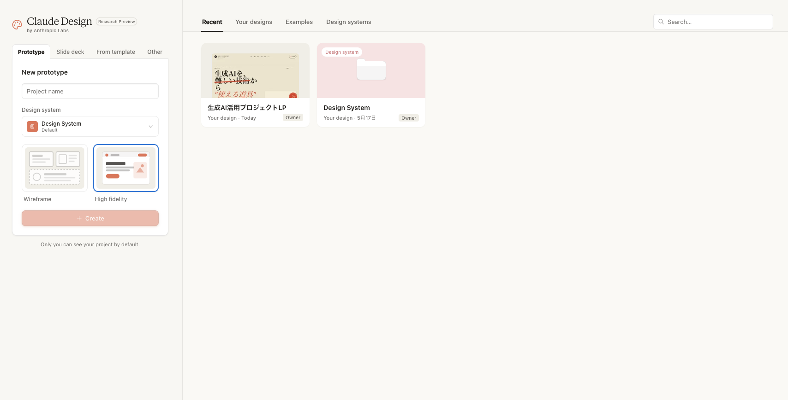
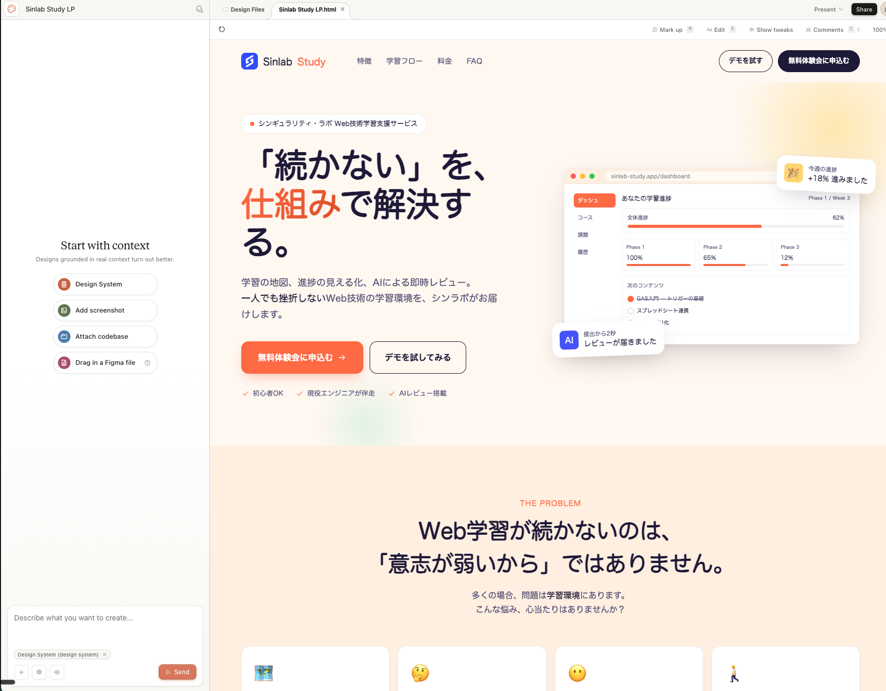
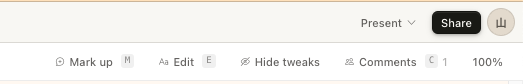
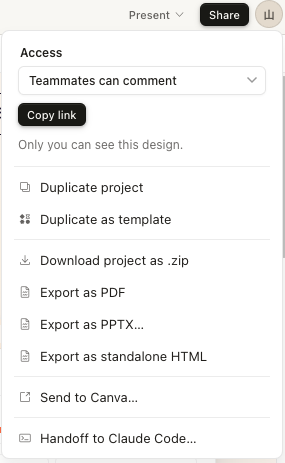

# Claude Design：デザインからコード実装まで一気通貫で進める

## はじめに

ここまでの記事では、CLAUDE.md・スラッシュコマンド・サブエージェント・MCP・Skills・Hooks、そしてそれらを束ねるハーネスエンジニアリングまで、Claude Codeを「使いこなす」ための要素を一つずつ見てきました。これらはすべて「コードを実装する」フェーズを支える仕組みです。

今回は少し視点を変えて、その手前にある「デザイン」のフェーズを担う新しいプロダクト、**Claude Design** を紹介します。2026年4月にAnthropic Labsから発表されたビジュアル制作向けのAIで、会話ベースでプロトタイプやスライドを作り、完成したデザインをそのまま **Claude Codeに引き継いで実装まで進められる** のが最大の特徴です。

> 本記事の内容は2026年6月時点のものです。Claude Designは段階的に提供が広がっているベータ段階のため、UI・機能名・料金は今後変わる可能性があります。実際に使う際は最新の公式情報も併せてご確認ください。

## Claude Designとは

Claude Designは、デザイン経験のないファウンダーやPM、エンジニアでも、アイデアを素早くビジュアルに落とし込めるようにすることを目指した製品です。クリックできるインタラクティブなプロトタイプ、スライド、ワンページャー、画面モックアップなどを、自然言語の会話だけで生成できます。

Claude Codeとの関係はシンプルです。**Claude Codeが「実装」を担当するのに対して、Claude Designは「実装前のビジュアル設計」を担当します**。アイデアを形にして関係者とすり合わせ、方向が固まったらClaude Codeに渡してコードにする、という分担です。

成果物で言えば、Claude Codeがソースコードやコミット・PRを生むのに対し、Claude Designはプロトタイプや画面モック・プレゼン資料を生みます。アイデア共有や要件のすり合わせ、社内資料づくりといった場面で力を発揮します。

## 利用できるプランと入り口

Claude Designは **Claude Pro / Max / Team / Enterprise** で利用できます。Freeプランでは使えません。Enterpriseは初期状態では無効になっており、管理者が組織設定の **Capabilities** から有効化します。

利用の入り口は2つあり、ブラウザで[claude.ai/design](https://claude.ai/design) にアクセスするか、Claudeデスクトップアプリのサイドバーから開きます。いずれもClaude Codeとは別の画面です。

<figure>

</figure>

利用量はチャットやClaude Codeとは **別メーター** で管理され、プランごとに週単位の枠があります。枠を使い切った場合は追加利用（Extra usage）でまかなえます。バックエンドにはAnthropicのOpus系モデルが使われています。

## 画面構成と基本ワークフロー

Claude Designの画面は **左がチャット、右がキャンバス** の2ペイン構成です。全体の方針を変えたいときは左のチャットに自然言語で書き、個別の要素をピンポイントで直したいときは右のキャンバス上の要素を直接操作します。画像やPDF、PPTXなどの素材はチャットに添付して渡せます。

<figure>

</figure>

公式が推奨する基本の流れは、次の5ステップです。

**ステップ1：プロジェクト作成** では、デザインの作り込み度を **Wireframe（ラフで素早く）** か **High Fidelity（本番に近い完成度）** から選びます。方向が定まっていなければWireframeで速く回し、固まってきたらHigh Fidelityに育てるのがおすすめです。

**ステップ2：コンテキスト追加** では、競合のスクリーンショットや既存LPのURL、社内資料などを最初にまとめて渡します。トーンと文脈が安定します。

**ステップ3：要件記述** では、いきなり全機能を盛り込まず、まず核となるレイアウトだけを作るのが鉄則です。

**ステップ4：レビュー** では、チャットで全体を、キャンバスで個別要素を確認します。コントラスト比やアクセシビリティの観点でClaudeにレビューさせることもできます。

**ステップ5：反復** では、チャットで大枠を変え、キャンバスで細部を直す、という順で仕上げていきます。

## キャンバスの4つの編集モード

キャンバスの右上には編集モードを切り替えるボタンが並んでいます。大きく分けると、**Claudeに修正を依頼する系（Mark up・Comments）** と、**自分で直接いじる系（Edit・Tweaks）** の2タイプです。

<figure>

</figure>

**Mark up** は、キャンバスに直接スケッチや手描きの注釈を描き込んで、視覚的に修正を指示するモードです。「ここをこう動かして」といった、言葉では位置を説明しづらいレイアウト変更に向いています。

**Comments** は、要素をクリックしてコメントとして指示文を残すモードです。「この見出しを短く」のように言語化しやすい変更に向いています。複数のコメントをまとめてClaudeに送ることもできます。

**Edit** は、要素を直接クリックしてテキスト・位置・サイズ・色などを手動で調整するモードです。Claudeを介さず、自分の手で任意の値に変更します。

**Tweaks** は、Claudeが用意したスライダーやカラーピッカーで微調整するモードです。背景プリセットやアクセントカラー、余白などをドラッグで動かすと、キャンバスがその場で更新されます。

大枠の変更はチャットやMark up、細部の仕上げはEditやTweaks、と組み合わせると効率的です。なお直近のアップデートでは、要素を直接ドラッグ・リサイズ・整列できる直接編集（Direct Canvas Editing）が強化され、チャットを介さない手作業の調整がしやすくなっています。

> 既知の不具合として、キャンバス上のコメントがClaudeに読まれる前に消えることがあります。重要な指示はキャンバスに書いたあと、同じ内容をチャットにも貼り直しておくと確実です。

## 良いプロンプトの書き方

Claude Designで狙い通りのデザインを得るコツは、プロンプトに **目標・レイアウト・コンテンツ・対象ユーザー** の4点を含めることです。

たとえば「かっこいい料金ページを作って」では情報が足りません。代わりに「スタートアップのCTO向けに、SaaSの料金ページを作ってください。3プラン横並びで上部にCTAを1つ。各プランにはプラン名・月額・年額・主要機能5件・推奨バッジを表示してください」のように具体的に書くと、意図が伝わりやすくなります。

複雑さは一度に足さず、コアレイアウト → コンテンツ → インタラクション → 仕上げ、と段階的にレイヤーを重ねていきます。「padding を16pxに」「primary色を1段階濃く」のように **定量的で具体的な指示** ほど正確に反映され、「もっとモダンに」のような抽象的な指示は当たり外れが大きくなります。

## Claude Codeとの連携・ハンドオフ

Claude Designの真価は、できあがったデザインを **Claude Codeへ引き継いで実装まで一気通貫で進められる** 点にあります。キャンバス右上の **Share** メニューから「Handoff to Claude Code」を選ぶと、ローカルのClaude Codeか、ブラウザ上の[claude.ai/code](https://claude.ai/code) のどちらかに渡せます。

<figure>

</figure>

このとき生成されるのが **ハンドオフバンドル** です。デザインの構造・コンポーネント・デザイントークン（色やフォントなどの設定値）・実装指示がひとまとまりになっており、Claude Codeはそれを1つのプロンプトとして受け取り、既存コードベースの規約に沿って実装を進めます。スクリーンショットを見て一から作り直すのではなく、既存の作業を引き継いで続きから実装する点がポイントです。

従来のデザイン受け渡しでは、Figmaの画面を見ながら手作業でコードに起こしたり、デザイン仕様を読み解いたりする手間が大きな摩擦になっていました。ハンドオフバンドルはこの摩擦を大きく減らします。デザインシステムを事前に整えておけば、Claude Code側の実装でも同じコンポーネントが再利用され、PRの差分も最小限に抑えられます。デザインシステムはGitHubリポジトリやデザインファイル、アップロードしたファイルから取り込むことができ、Claudeは生成結果をそのデザインシステムと照合しながら作っていきます。

2026年6月のアップデートで、この受け渡しは **双方向の同期** に進化しました。Claude Code側からは **/design-sync** でデザインシステムをリポジトリに取り込め、**/design** コマンドを使えばターミナルを離れずにデザインプロジェクトの作成・編集・同期ができます。デザインからコードへ、コードからデザインへと行き来しても作業が同期され続けるため、いったん実装するとコードが先行してデザインと乖離していく、という従来の問題が起きにくくなっています。

なお、Claude Code以外にもPDF・PPTX・HTML・ZIPといった形式でエクスポートできるほか、Canva・Adobe・Vercel・Replit・Gamma・Lovable・Miro・Wixなど外部サービスへの連携先も増えています（今後さらに追加予定）。組織内の共有リンクで関係者にレビューしてもらうこともできます。

## まとめ

Claude Designは、Claude Codeが担う「実装」の手前にある「ビジュアル設計」を担当する、Anthropic Labsの新しいプロダクトです。会話ベースでインタラクティブなプロトタイプやスライドを生成できます。

入り口はブラウザの[claude.ai/design](https://claude.ai/design) で、画面は左チャット＋右キャンバスの2ペイン構成です。推奨ワークフローは「作成 → コンテキスト → 要件 → レビュー → 反復」の5ステップ。プロンプトには目標・レイアウト・コンテンツ・対象ユーザーを含め、段階的に複雑さを足していくのがコツです。

そして最大のポイントは、Share メニューからの **Claude Codeへのハンドオフ**。ハンドオフバンドルを介して、デザインから実装までを一気通貫で進められ、2026年6月のアップデートではデザインとコードを双方向に同期できるようになりました。まだベータ段階のため、まずは小さなプロジェクトで試して、エクスポート結果や実装品質を確かめてみるとよいでしょう。

---

## プログラミングイベントのご案内
毎月数回、AIを活用したプログラミングを学べるオンライン講座を開催しております。直接学びたい方はぜひご参加ください。
申し込みフォームは[こちら](https://docs.google.com/forms/d/e/1FAIpQLScCLBSCJvZEl7R15tCDTajcKa7INCTSOKPEXyfIEX69Q_xtEg/viewform)
過去のプログラミングイベントの紹介は[こちら](https://sinlab.future-tech-association.org/school/)

## シンギュラリティ・ラボのご案内
オンラインサロン「シンギュラリティ・ラボ」（通称シンラボ）では、GASも含めたプログラミングをはじめ、さまざまなITスキルやチーム開発について学び、実践する場を準備しております。 初心者から経験者まで、どなたでも参加可能です。
少しでも興味がございましたらお気軽にお越しください。
シンギュラリティ・ラボHPは[こちら](https://sinlab.future-tech-association.org/join/)
お問い合わせ先 sinlab-recruit@future-tech-association.org

## GASアプリ開発サービスのお知らせ
シンギュラリティ・ラボでは、GASを中心としたWebアプリ開発のご相談を受け付けております。
普段の作業のちょっとした自動化から自分やチーム専用のカスタムアプリまで、ぜひお気軽にお問い合わせください。
詳細は[こちら](https://appdev.future-tech-association.org/)
