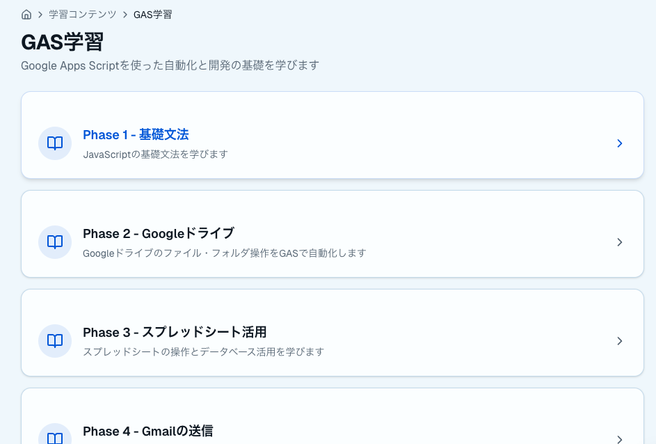
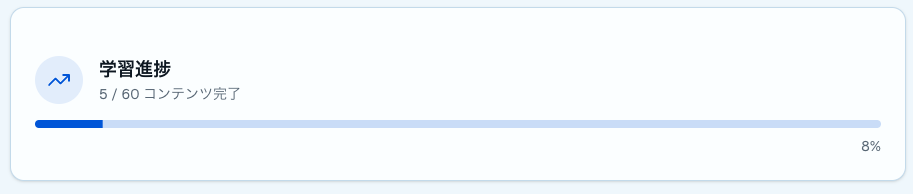
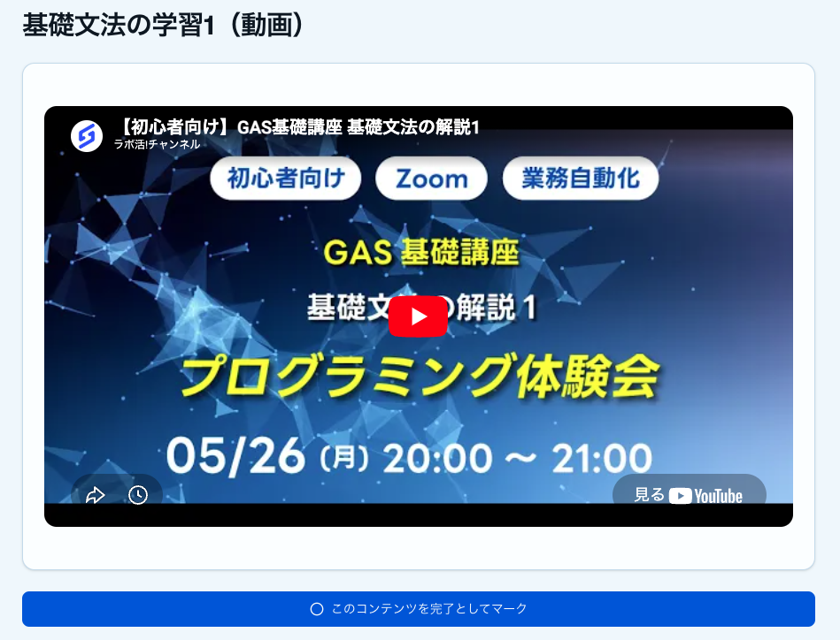
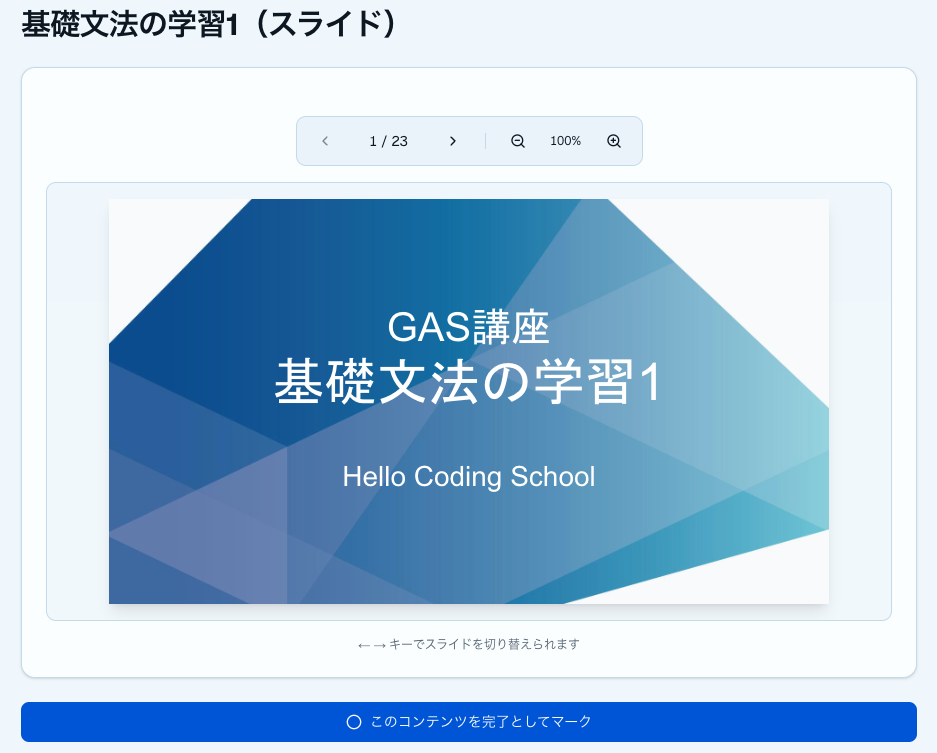
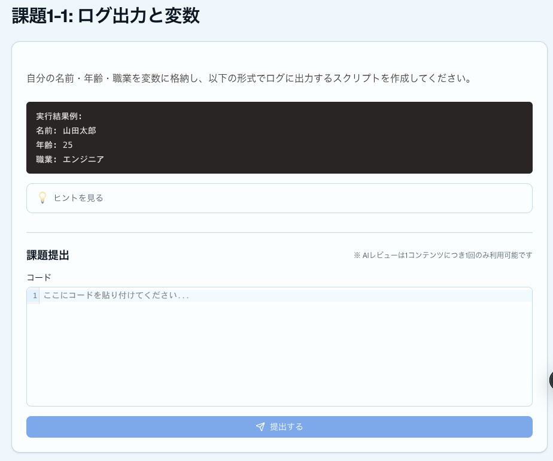
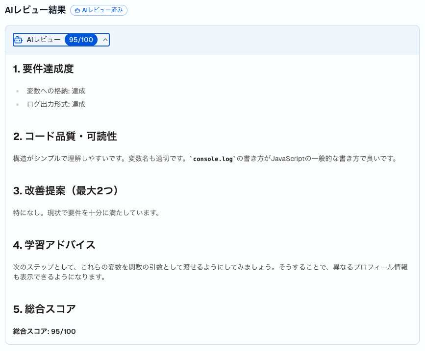

# 「続けられる学習環境」を提供する、Sinlab Study とは

## プログラミング学習が続かない本当の理由

プログラミングを学ぼうとして、途中で挫折した経験はありませんか？

書籍を買ったけど読み切れなかった。動画講座を買ったけど途中で止まってしまった。そういった声はとても多く聞かれます。しかし、挫折の原因は「意志が弱いから」ではありません。

多くの場合、問題は**学習環境**にあります。

- 自分が今どのくらい進んでいるのかわからない
- 次に何をやればいいのかわからない
- 課題を提出しても反応がなく、やりがいを感じにくい
- 周囲に学習仲間がいないので、孤独に続けるしかない

**Sinlab Study**は、こうした「続けられない」原因を取り除くことを目的に設計された、シンラボの学習支援Webアプリケーションです。なお、本サービスは**オンラインサロン「シンギュラリティ・ラボ」の会員限定**で提供されます。

## 扱うテーマはウェブスキル全般

Sinlab Study で学べる内容は、プログラミングにとどまりません。GASをはじめとするプログラミングに加え、**AI駆動開発やウェブ開発といったウェブスキル全般**を対象としています。

現在はGAS学習のコンテンツからスタートしており、順次テーマを拡充していく予定です。「AIを使いながら開発する方法を学びたい」「Webの知識を体系的に身につけたい」という方にも対応できるサービスを目指しています。

## 学習の「地図」が手に入る

学習コンテンツは「Phase（フェーズ）→ Week（週）→ コンテンツ」という3階層で整理されています。

例えば「Phase 1の Week 3まで終わった」といった形で、自分が今どこにいるのかが常に明確です。次に何をやるべきかが迷わずわかるため、**学習のたびに「今日は何をやろうか」と悩む時間がなくなります**。

地図のない山登りは不安ですが、地図があれば「あの山頂まであと少し」と踏ん張れる。学習も同じです。

学習フェーズ

## 進捗が「見える」ことで、やる気が続く

ダッシュボードには、全体の学習進捗率とPhase・Week単位の進捗バーが表示されます。各コンテンツの「完了」ボタンを押すたびに進捗率が上がり、自分の成長が数字とビジュアルで確認できます。

**「今週これだけ進んだ」という実感は、次の学習への大きなモチベーションになります。**

スポーツで記録を計測すると上達が早くなるのと同じで、学習でも進捗の見える化は効果的です。

学習進捗

## 動画・テキスト・演習で、理解を定着させる

コンテンツは3種類で構成されています。

- **動画教材** — 講師による解説動画で概念をつかむ
- **テキスト教材** — 手元に残るテキストで理解を深める
- **演習課題** — 実際に手を動かして知識を定着させる

「見るだけ」で終わらず、**必ず手を動かす演習がセットになっているのが大きな特徴**です。プログラミングは書いてみて初めて身につくもの。演習課題を通じて、実践的なスキルを着実に積み上げることができます。

    
    

学習コンテンツ

## 課題提出で「やり切った感」が生まれる

演習課題は、書いたコードをそのまま入力して提出できます。コードの入力欄にはシンタックスハイライトと自動フォーマット機能が搭載されており、**コードの見やすさを保ちながら、快適に書くことができます**。

提出した課題は履歴として残るため、自分がどれだけ取り組んできたかを振り返ることができます。**「提出した」という行為そのものが、やり切った満足感につながり**、次の課題への意欲を生み出します。

演習課題

## 提出直後にAIがコードをレビュー

この学習支援サービスの大きな特徴のひとつが、**課題を提出するとすぐにAIによるコードレビューが行われる**ことです。

これまで独学では「このコードで合っているのかな？」と疑問を抱えたまま次に進むしかありませんでした。しかし本サービスでは、提出後すぐにフィードバックが返ってくるため、理解の確認や改善点の把握を即座に行えます。

「課題を提出して終わり」ではなく、**フィードバックを受けて理解を深める**という学習サイクルが、効率的なスキルアップを後押しします。

<!-- 画像挿入: 07_ai_review_page.png -->

AIレビュー結果の例

## 運営がしっかりフォローできる体制

Sinlab Study での学びは、アプリの中だけで完結しません。シンギュラリティ・ラボのコミュニティ全体がサポートしてくれる環境が整っています。

**現役エンジニアへの相談**ができるのも大きな強みです。学習中に詰まったことや、実務に近い疑問も気軽に聞ける環境があるため、独学では解決しにくい壁を乗り越えやすくなっています。

また、定期的に**もくもく会や会員限定の勉強会**も開催されています。同じ目標を持つ仲間と一緒に学ぶ機会があることで、学習のペースが保ちやすくなり、モチベーションの維持にもつながります。

**「独学だと誰にも見てもらえない」という孤独感がなく、仲間と一緒に成長できる環境**がシンラボならではの特徴です。

## こんな方にぴったりのサービスです

- GASやWeb技術を学びたいけれど、何から始めればいいかわからない
- 独学で続かなかった経験がある
- 学習の進捗を管理しながら、着実にスキルを身につけたい
- 実際に手を動かして、使えるスキルを習得したい
- AIをうまく活用しながら効率よく学びたい

## まとめ

**Sinlab Study** は、「AIと学ぶ実践Web技術講座」を支える学習支援サービスであり、**学習が続かない原因を仕組みで解決する**ことを目指したプラットフォームです。

学習の地図、進捗の見える化、動画・テキスト・演習のセット学習、シンプルな課題提出——これらが組み合わさることで、一人でも挫折しにくい学習体験を実現しています。

本サービスはシンギュラリティ・ラボの会員限定です。「AIと学ぶ実践Web技術講座」への参加には、まずシンギュラリティ・ラボへの入会が必要となります。興味のある方は、ぜひ下記のイベントや説明会にお越しください。

---

## プログラミングイベントのご案内
毎月数回、AIを活用したプログラミングを学べるオンライン講座を開催しております。直接学びたい方はぜひご参加ください。
申し込みフォームは[こちら](https://docs.google.com/forms/d/e/1FAIpQLScCLBSCJvZEl7R15tCDTajcKa7INCTSOKPEXyfIEX69Q_xtEg/viewform)
過去のプログラミングイベントの紹介は[こちら](https://sinlab.future-tech-association.org/school/)

## シンギュラリティ・ラボのご案内
オンラインサロン「シンギュラリティ・ラボ」（通称シンラボ）では、GASも含めたプログラミングをはじめ、さまざまなITスキルやチーム開発について学び、実践する場を準備しております。 初心者から経験者まで、どなたでも参加可能です。
少しでも興味がございましたらお気軽にお越しください。
シンギュラリティ・ラボHPは[こちら](https://sinlab.future-tech-association.org/join/)
お問い合わせ先 sinlab-recruit@future-tech-association.org

## GASアプリ開発サービスのお知らせ
シンギュラリティ・ラボでは、GASを中心としたWebアプリ開発のご相談を受け付けております。
普段の作業のちょっとした自動化から自分やチーム専用のカスタムアプリまで、ぜひお気軽にお問い合わせください。
詳細は[こちら](https://appdev.future-tech-association.org/)
