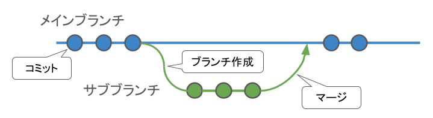
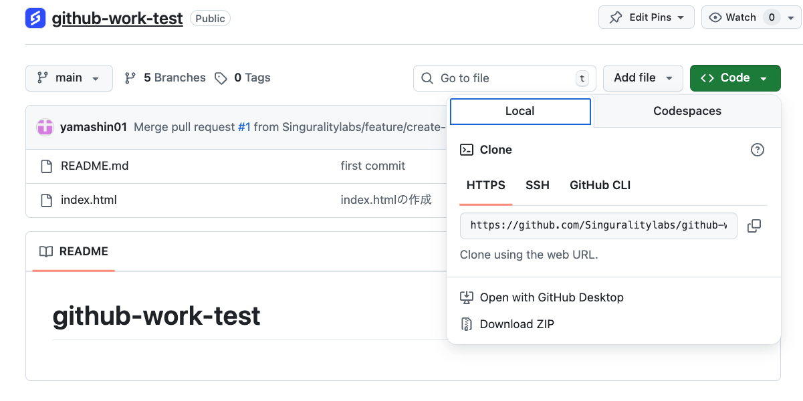
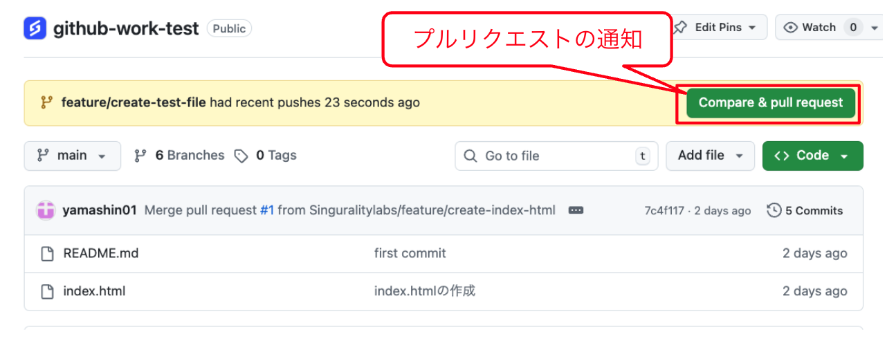
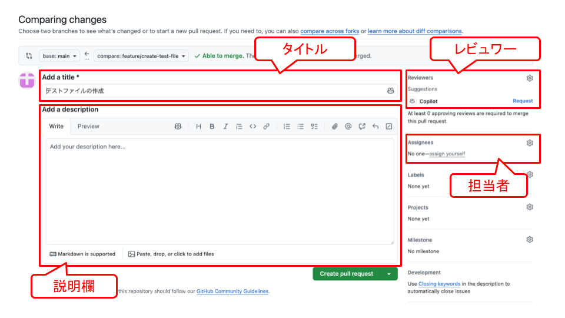
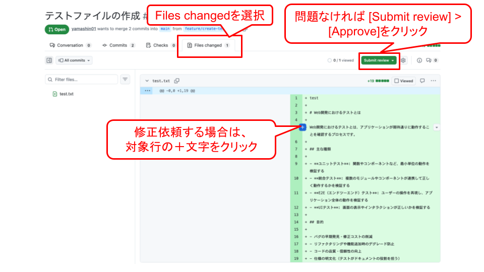
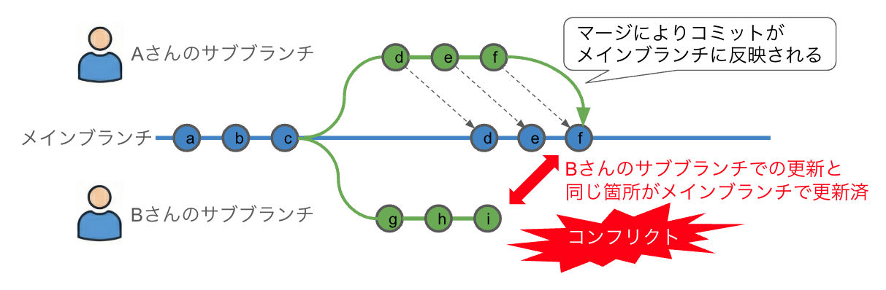

# GitHubによるチーム開発

## はじめに

チームで一つのアプリを開発するとき、複数人が同じコードを同時に編集するとさまざまな問題が起きます。GitHubはこうした問題を解決するための仕組みを持っており、チーム開発において欠かせないツールです。

この記事では、GitHubを使ったチーム開発の基本的な流れを、実際の操作を交えながら解説します。ブランチの作成からプルリクエスト、コンフリクトの解消まで、実践的な内容をひとつずつ確認していきましょう。

## ブランチとは何か

Gitにはブランチという機能があります。ブランチとは「枝」という意味で、開発の流れを分岐させる機能です。

チーム開発では、全員が同じメインブランチを直接編集すると操作が衝突してしまいます。これを避けるために、**メインブランチからコピーして新しいブランチを作成し、そこで作業を行う**というのが基本的な流れです。

新機能の追加やバグの修正が完了したら、その変更をメインブランチに取り込みます。この操作を**マージ**と呼びます。

<center>
    
    ブランチ作成からマージまで
</center>

### ブランチの命名ルール

ブランチ名には日本語が使えないため、必ず英語で付けてください。また、ブランチ名には今から何をしようとしているかが分かる名前をつけることを推奨します。

多くのチームや企業では、ブランチ名の冒頭に以下のような接頭辞をつける習慣があります。

- **feature/** ：新しい機能の追加
- **fix/** または **bug/** ：バグの修正
- **refactor/** ：コードの整理・改善

たとえばログイン機能を新たに実装するなら `feature/create-login` のような名前にします。こうすることで、ブランチの一覧を見るだけでそれぞれの目的が一目でわかります。

### ブランチの操作コマンド

Visual Studio CodeやCursorなどのエディタにはGitの機能が組み込まれており、ボタン操作でブランチを作成・切り替えできます。一方で、基本的なコマンドも把握しておくと、より柔軟に操作できます。

新しいブランチを作成して切り替えるには以下のコマンドを使います。

```bash
git checkout -b feature/new-feature
```

既存のブランチに切り替えるには次のようにします。

```bash
git checkout main
```

現在のブランチ一覧を確認するにはこちらです。

```bash
git branch
```

不要になったブランチを削除するコマンドもあります。

```bash
git branch -d feature/new-feature
```

なお、`git branch -d` はローカルのブランチしか削除しません。GitHubのリモートリポジトリ側のブランチは残ったままになるので注意が必要です。

## リポジトリの権限管理

複数人で同じリポジトリを使う場合、まずメンバーに編集権限を付与する必要があります。

GitHubのリポジトリ管理画面にある **Settings（設定）** から **Collaborators & teams** を開くと、メンバーをリポジトリに追加できます。個人のGitHubアカウント名またはメールアドレスで検索し、招待することで編集権限を渡せます。

招待されたメンバーには確認メールが届くので、承認することでリポジトリへのアクセスが可能になります。

## リモートリポジトリをローカルに取り込む

GitHubのリポジトリをはじめて自分のPCに取り込む操作を **クローン** と呼びます。

リポジトリの管理画面にある緑色の **Code** ボタンをクリックすると、`https://` から始まるURLが表示されます。これをコピーして、ターミナルで次のコマンドを実行します。

```bash
git clone https://github.com/ユーザー名/リポジトリ名.git
```

成功するとフォルダが作成され、リポジトリの内容がダウンロードされます。

<center>
    
    クローン用URLの取得場所
</center>

## プルリクエストの作成

ブランチで作業が完了したら、変更をメインブランチに反映するための手続きを行います。この手続きを **プルリクエスト**（Pull Request、PRとも呼ばれます）と言います。

プルリクエストは「このブランチの変更内容をメインブランチに取り込んでいいですか？」という確認のステップです。

### 実際の流れ

まずブランチで行った変更をコミットし、リモートリポジトリへプッシュします。

```bash
git add ファイル名
git commit -m "コミットメッセージ"
git push origin ブランチ名
```

プッシュするとGitHubの管理画面に通知が表示されます。そこから **Compare & pull request** ボタンをクリックするか、**Pull requests** タブから **New pull request** を選んでプルリクエストを作成します。

<center>
    
    GitHub管理画面でのプルリクエストの通知
</center>

プルリクエストには以下の情報を設定できます。

- **タイトル** ：変更内容を端的に表したタイトル
- **説明** ：変更の背景や内容を詳しく記載するエリア
- **Assignees（担当者）** ：このプルリクエストの担当者
- **Reviewers（レビュアー）** ：コードをレビューしてもらう人

<center>
    
    プルリクエスト作成画面
</center>

## コードレビューと**approve**

レビュアーはプルリクエストの **Files changed** タブから変更内容を確認します。

各行にカーソルを合わせると青いプラスボタンが表示されます。これをクリックするとコメントを残せます。「ここの書き方をこう変更してください」といった指摘をこの画面で行います。

レビューが完了し、問題ないと判断した場合は **Submit review** から **Approve** を選択します。これが**approve**です。

**approve**が行われると、**Merge pull request** ボタンが有効になり、マージを実行できるようになります。

<center>
    
    コードレビューとアプルーブ
</center>

## コンフリクトの解消

複数人が**同じファイルの同じ行を別々に編集した場合**、マージ時に **コンフリクト（競合）** が発生することがあります。コンフリクトとは「どちらの変更を正しいものとして採用すればよいか分からない」という状態です。

プルリクエストの画面に `This branch has conflicts that must be resolved` と表示されたらコンフリクトが発生しています。

<center>
    
    コンフリクトの発生
</center>

### リベースによる解消手順

コンフリクトを解消する代表的な方法が **git rebase** です。以下の手順で進めます。

**ステップ1：メインブランチを最新化する**

まずメインブランチに切り替えて、最新の状態に更新します。

```bash
git checkout main
git pull
```

**ステップ2：作業ブランチでリベースを実行する**

作業ブランチに戻り、リベースを実行します。

```bash
git checkout feature/your-branch
git rebase main
```

**ステップ3：コンフリクト箇所を手動で修正する**

エディタにコンフリクト箇所が表示されます。`<<<<<<< HEAD` から `=======` の間が現在のメインブランチの内容、`=======` から `>>>>>>> ブランチ名` の間が自分のブランチの内容です。

Visual Studio Codeなどのエディタでは **「現在の変更を取り込む」「入力側の変更を取り込む」「両方の変更を取り込む」** といったボタンが表示されるので、状況に応じて選択します。

**ステップ4：修正をステージングし、リベースを続行する**

コンフリクトを解消したらファイルをステージングし、リベースを続行します。

```bash
git add 修正したファイル名
git rebase --continue
```

コミットメッセージの確認画面が開いたら `:wq` と入力して保存してください。成功すると `Successfully rebased` と表示されます。

### 強制プッシュ

リベース後はコミット履歴が書き換わるため、通常のプッシュではエラーになります。この場合は **強制プッシュ** を使います。

```bash
git push --force-with-lease origin HEAD
```

`--force-with-lease` は、自分が意図しない変更を誤って上書きするリスクを抑えた、より安全な強制プッシュのオプションです。単純な `--force` でも動作しますが、`--force-with-lease` の使用を推奨します。

強制プッシュ後はプルリクエストのコンフリクトエラーが解消され、レビュー・マージへと進めるようになります。

## ブランチ保護ルールの設定

GitHubでは、メインブランチを誤って直接更新してしまわないように保護ルールを設定できます。

リポジトリの **Settings → Branches → Rulesets** から新しいルールを作成し、以下のような設定が可能です。

**Restrict deletions**
決められたメンバー以外はブランチを削除できないようにします。

**Require a pull request before merging**
メインブランチへの直接プッシュを禁止し、必ずプルリクエストを経由させます。

**Require approvals**
**approve**が必須になります。数値を `2` に設定すると2人以上の**approve**が必要になるなど、人数を自由に設定できます。

チームの開発規模や慎重さに応じて、適切なルールを設けておくと安全性が高まります。

## まとめ

GitHubによるチーム開発の基本的な流れをまとめると次のようになります。

- メインブランチからブランチを切って作業する
- 作業が完了したらコミット・プッシュしてプルリクエストを作成する
- レビュアーがコードを確認して**approve**することでマージが可能になる
- コンフリクトが発生したらリベースで解消し、強制プッシュで更新する

この流れを繰り返すことでチームとしてコードをどんどんアップデートしていけます。最初は操作が複雑に感じるかもしれませんが、慣れるほど自然にこなせるようになります。ぜひ実際の開発の中で手を動かしながら体得していってください。

---

## プログラミングイベントのご案内
毎月数回、AIを活用したプログラミングを学べるオンライン講座を開催しております。直接学びたい方はぜひご参加ください。
申し込みフォームは[こちら](https://docs.google.com/forms/d/e/1FAIpQLScCLBSCJvZEl7R15tCDTajcKa7INCTSOKPEXyfIEX69Q_xtEg/viewform)
過去のプログラミングイベントの紹介は[こちら](https://sinlab.future-tech-association.org/school/)

## シンギュラリティ・ラボのご案内
オンラインサロン「シンギュラリティ・ラボ」（通称シンラボ）では、GASも含めたプログラミングをはじめ、さまざまなITスキルやチーム開発について学び、実践する場を準備しております。 初心者から経験者まで、どなたでも参加可能です。
少しでも興味がございましたらお気軽にお越しください。
シンギュラリティ・ラボHPは[こちら](https://sinlab.future-tech-association.org/join/)
お問い合わせ先 sinlab-recruit@future-tech-association.org

## GASアプリ開発サービスのお知らせ
シンギュラリティ・ラボでは、GASを中心としたWebアプリ開発のご相談を受け付けております。
普段の作業のちょっとした自動化から自分やチーム専用のカスタムアプリまで、ぜひお気軽にお問い合わせください。
詳細は[こちら](https://appdev.future-tech-association.org/)
