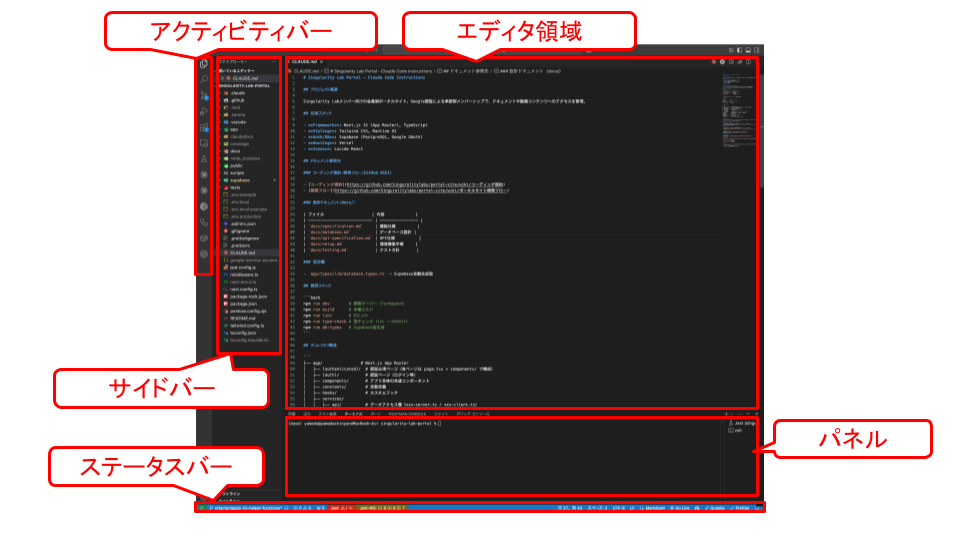
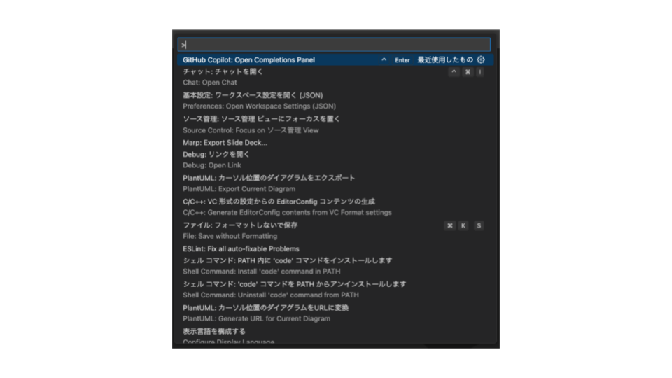
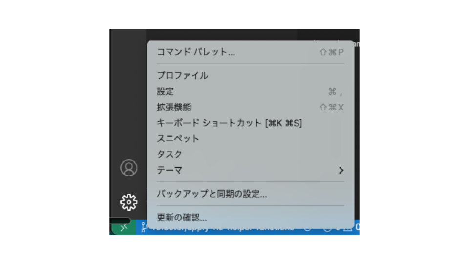

# はじめてのVSCode — 画面構成・基本操作・設定をやさしく解説

## はじめに

VSCode（Visual Studio Code）は、Microsoftが無料で公開しているコードエディタです。動作が軽く、拡張機能も豊富で、Web開発から機械学習まで幅広い分野で使われています。これからプログラミングを学ぶ人がはじめに触るエディタとしても、もっとも候補に挙がるツールのひとつです。

ただ、起動して最初に画面を見ると、アイコンやパネルが多くて戸惑うかもしれません。この記事では、VSCodeを使い始めた人がまず押さえておきたい次の3つを、シンプルにまとめます。

- **インストール**：手元のPCでVSCodeを使える状態にする
- **画面構成**：どこに何があるのかを把握する
- **基本操作**：日々の作業で頻度が高いものに絞って覚える
- **設定**：自分やチームに合わせてカスタマイズする

## VSCodeのインストール

VSCodeは[公式サイト](https://code.visualstudio.com/)から無料でダウンロードできます。トップページにある **"Download for ..."** ボタンが、アクセスしているOSに応じて自動で切り替わるので、そのままダウンロードに進めます。OSごとにインストールの流れを確認しておきましょう。

### macOSの場合

ダウンロードしたzipファイルを展開すると **Visual Studio Code.app** が出てくるので、それを **アプリケーションフォルダ** にドラッグ＆ドロップで移動します。初回起動時に「インターネットからダウンロードしたアプリです」という確認ダイアログが出たら「開く」を選んでください。

Apple Silicon（M1／M2／M3）とIntel Macで別バイナリが配布されていますが、公式サイトが自動で判定して適切なものを配信してくれるので、特に意識する必要はありません。

### Windowsの場合

ダウンロードしたインストーラー（**VSCodeUserSetup-バージョン.exe**）をダブルクリックして実行します。ライセンスに同意し、インストール先はそのままで進んで構いません。途中の **追加タスク** の画面では、次の項目にチェックを入れておくと後々便利です。

- **PATHへの追加** ：ターミナルから **code** コマンドが使えるようになる
- **エクスプローラーのコンテキストメニューに "Code で開く" を追加** ：右クリックからフォルダをVSCodeで開けるようになる

個人で使うPCであれば **User Installer** 版で十分です。

### code コマンドを使えるようにする（macOS）

ターミナルから **code .** のように打って、現在のフォルダをVSCodeで開けるようにしておくと作業がぐっとスムーズになります。設定方法は次のとおりです。

VSCodeを起動してコマンドパレット（**Cmd + Shift + P**）を開き、**Shell Command: Install 'code' command in PATH** と入力して実行します。これだけでパスが通ります。

その後、ターミナルで動作確認しましょう。

```bash
code --version    # バージョンが表示されればOK
code .            # 現在のフォルダをVSCodeで開く
```

Windowsの場合は、インストール時に「PATHへの追加」をチェックしておけば、コマンドプロンプトやPowerShellから **code** コマンドがそのまま使えます。

### 日本語化（任意）

VSCodeは初期状態では英語UIです。日本語に切り替えたい場合は、拡張機能 **Japanese Language Pack for Visual Studio Code** をインストールします。左端のアクティビティバーから拡張機能アイコンを開き、検索ボックスに **Japanese** と入れて出てくる候補から選んでインストールし、表示される「Restart」ボタンで再起動すれば日本語化されます。

なお、開発の現場では公式ドキュメントやエラーメッセージとの整合性を取るために英語のまま使う人も多いです。まずは英語で試してみて、しっくりこなければ日本語に切り替える、という選び方でも問題ありません。

## VSCodeの画面構成

VSCodeのウィンドウは見た目こそ複雑ですが、**5つの領域 + コマンドパレット**という構造で捉えると一気に整理できます。



それぞれの役割をひと言で押さえておきましょう。

- **アクティビティバー（左端の縦アイコン列）** ：エクスプローラー、検索、ソース管理、拡張機能などの機能を切り替える入口
- **サイドバー** ：アクティビティバーで選んだ機能の中身（ファイルツリーや検索結果など）を表示する
- **エディター領域** ：実際にコードを編集する中心エリア。タブ切り替えや画面分割で複数ファイルを並べられる
- **パネル（下部）** ：問題・出力・デバッグコンソール・ターミナルなど、補助的なツールが集まる場所
- **ステータスバー（最下部）** ：Gitブランチ、エラー件数、カーソル位置、文字コード、言語モードなどが常に表示される

ボタンの場所をひとつずつ覚えようとしなくても、「これは左の縦バー」「これは下のパネル」というレベルで配置を把握しておけば、必要になったときに触りに行けます。

そして、これら5領域と並んで重要なのが**コマンドパレット**です。重要度が高いので、独立したセクションで解説します。

## コマンドパレット — 最初に覚えてほしい機能

**コマンドパレット**は、VSCodeの**ほぼすべての操作にテキスト検索でアクセスできる**オーバーレイ画面です。「使いこなせるかどうかが、入門と中級の分かれ目」と言われるほど重要で、画面のどこからでも呼び出せます。



### 開き方

- macOSなら **Cmd + Shift + P**、Windowsなら **Ctrl + Shift + P**
- どちらのOSでも **F1** キーでも開けます
- ファイル名検索専用に開きたいときは **Cmd + P**（Windowsは **Ctrl + P**）

### プレフィックスでモードが切り替わる

入力欄の先頭につける記号によって、検索対象がガラッと変わります。

- **記号なし** ：ファイル名で検索（**Cmd + P** / **Ctrl + P** で開いたときと同じ動き）
- **> （半角の大なり）** ：コマンドを検索する。例として **>format document** で現在のファイルを整形
- **@** ：開いているファイル内のシンボル（関数名や変数名）にジャンプ
- **#** ：プロジェクト全体のシンボルにジャンプ
- **: （半角コロン）** ：指定した行番号にジャンプ。例として **:42** で42行目へ
- **?** ：使えるモードの一覧を表示するヘルプ

**Cmd + Shift + P**（**Ctrl + Shift + P**）で開くと先頭に **>** が自動で入り、**Cmd + P**（**Ctrl + P**）で開くと無印で開きます。開いた後に先頭の文字を打ち直せば、いつでも別モードに切り替えられます。

### 使いこなしのコツ

- 「フォーマットしたい」「設定を開きたい」と思ったら、関連するキーワードを打ち込んで候補を眺める
- 候補の右側に**ショートカットキーが併記**されるので、自然とよく使う操作のキーが覚えられる
- 前回使ったコマンドが先頭に表示されるので、繰り返しの作業はEnterだけで再実行できる
- 拡張機能の調子が悪いときは **>developer: reload window** でウィンドウを再読み込みすると直ることが多い

ボタンの位置を覚えるのではなく、「迷ったらコマンドパレット」というクセをつけるだけで、日々の作業速度が大きく変わります。

## VSCodeの基本操作

次に、毎日の作業で頻度が高い操作を厳選して紹介します。最初はこの4つを覚えておけば十分です。

### ファイルを素早く開く

エクスプローラーから探すのもよいですが、ファイル数が増えてくると非効率になります。**Cmd + P**（Windowsは**Ctrl + P**）で開く**クイックオープン**を使うと、ファイル名を数文字打つだけで目的のファイルにジャンプできます。

たとえば**auth.ts**というファイルを開きたい場合は、**auth**と数文字打てば候補に出てきて、Enterで開けます。慣れるとマウス操作よりも遥かに速くなります。

### 検索と置換

検索には2種類あります。

- **Cmd + F** （Windowsは **Ctrl + F**）：今開いているファイルの中だけを検索する
- **Cmd + Shift + F** （Windowsは **Ctrl + Shift + F**）：プロジェクト全体（開いているフォルダ全体）を検索する

それぞれ置換にも対応しています。検索ボックスには大文字小文字の区別、単語単位の一致、正規表現を切り替えるトグルボタンがあるので、目的に応じて使い分けてください。

### マルチカーソル

VSCodeの強みのひとつが**マルチカーソル**です。複数の場所に同時にカーソルを置き、まったく同じ編集を一度に行えます。代表的な使い方は次のとおりです。

- **Cmd + D** （Windowsは **Ctrl + D**）：選択中の単語と同じ単語を、出現する順に1つずつ追加選択する
- **Cmd + Shift + L** （Windowsは **Ctrl + Shift + L**）：選択中の単語と一致するものをファイル内で一括選択する
- **Option + クリック** （Windowsは **Alt + クリック**）：マウスで任意の位置にカーソルを自由に追加する
- **Cmd + Option + ↑ / ↓** （Windowsは **Ctrl + Alt + ↑ / ↓**）：現在の位置から上下の行にカーソルを伸ばしていく
- **Shift + Option + ドラッグ** （Windowsは **Shift + Alt + ドラッグ**）：マウスで矩形（縦長）の範囲をまとめて選択する

前半2つはキーワードを基準にした選択、後半3つは**Option（Alt）キー**を使った位置ベースの操作です。とくに **Shift + Option + ドラッグ** の矩形選択は、連続した複数行の先頭や末尾にまとめて文字を追加したいときなど、検索置換では扱いにくいケースで威力を発揮します。

### 統合ターミナル

VSCodeにはターミナルが組み込まれています。**Ctrl + バッククォートキー**（Macも同じ）で開閉でき、bashやzsh、PowerShellなどのシェルを切り替えながら使えます。

エディタとターミナルを別ウィンドウで開く必要がないため、「コードを編集してテストを走らせる」「Gitコマンドを実行する」といった作業がVSCode内で完結します。

## 設定とカスタマイズ

VSCodeは初期状態でも十分使えますが、自分の好みやプロジェクトの規約に合わせて細かく調整できます。設定の仕組みを理解しておくと、後々ぐっと使いやすくなります。

### 設定は3階層で管理される

VSCodeの設定は、優先順位の異なる3つの階層に分かれています。

- **ユーザー設定** ：自分のVSCode全体に効く。フォントサイズや配色など個人の好みを保存する場所
- **ワークスペース設定** ：開いているプロジェクトだけに効く。プロジェクト内の **.vscode/settings.json** に保存される
- **フォルダ設定** ：マルチルートワークスペースの個別フォルダごとに効く

下の階層ほど優先度が高くなります。チーム開発では、共通で揃えたい設定（インデント幅やフォーマッタなど）はワークスペース設定としてリポジトリにコミットし、個人の好み（フォントやテーマなど）はユーザー設定に書く、という分け方が定石です。

### 設定画面とsettings.json

設定の入り口は2つあります。**Cmd + ,**（Windowsは**Ctrl + ,**）で開く**設定画面（GUI）**と、JSONファイルを直接編集する**settings.json**です。両者は同じデータの異なるビューなので、どちらで編集しても結果は同じになります。



入門者ははじめのうちGUIで十分ですが、慣れてきたら直接JSONを編集するほうが早く感じる場面も増えてきます。

入れておくと体感が変わる代表的な設定例を挙げておきます。

```jsonc
{
  // エディタの見た目
  "editor.fontSize": 14,
  "editor.minimap.enabled": false,

  // 保存したときに自動でフォーマットする
  "editor.formatOnSave": true,

  // 一定時間で自動保存する
  "files.autoSave": "onFocusChange",
  "files.trimTrailingWhitespace": true,
  "files.insertFinalNewline": true
}
```

**editor.formatOnSave** を有効にしておくと、ファイルを保存するたびにコードが自動で整形されるので、インデントずれなどの細かい乱れが起きにくくなります。

### テーマで見た目を変える

VSCodeでは画面の配色やアイコンも自由に変えられます。コマンドパレットを開いて **color theme** と入力すると**カラーテーマ**の切替画面が、**file icon theme** と入力すると**アイコンテーマ**の切替画面が出てきます。

ダークテーマで目が疲れにくくする、好みの配色で気分を上げる、といった工夫が手軽にできるので、ぜひ最初に自分好みの組み合わせを見つけてみてください。

## まとめ

この記事では、VSCodeを使い始めた人がまず押さえておきたい3つのトピックを紹介しました。

- 画面は**5領域 + コマンドパレット**で構成され、それぞれの役割を覚えると迷わなくなる
- 基本操作はクイックオープン・検索・マルチカーソル・統合ターミナルの4つから覚える
- 設定は**3階層**で管理され、GUIとsettings.jsonの両方から編集できる

この3つを押さえておけば、日々のコーディング作業はだいたい快適にこなせるようになります。さらに踏み込みたい方は、Git連携やキーボードショートカットなど、より生産性を上げる機能にも順番に触れてみてください。次の記事ではそのあたりを扱う予定です。

---

## プログラミングイベントのご案内
毎月数回、AIを活用したプログラミングを学べるオンライン講座を開催しております。直接学びたい方はぜひご参加ください。
申し込みフォームは[こちら](https://docs.google.com/forms/d/e/1FAIpQLScCLBSCJvZEl7R15tCDTajcKa7INCTSOKPEXyfIEX69Q_xtEg/viewform)
過去のプログラミングイベントの紹介は[こちら](https://sinlab.future-tech-association.org/school/)

## シンギュラリティ・ラボのご案内
オンラインサロン「シンギュラリティ・ラボ」（通称シンラボ）では、GASも含めたプログラミングをはじめ、さまざまなITスキルやチーム開発について学び、実践する場を準備しております。 初心者から経験者まで、どなたでも参加可能です。
少しでも興味がございましたらお気軽にお越しください。
シンギュラリティ・ラボHPは[こちら](https://sinlab.future-tech-association.org/join/)
お問い合わせ先 sinlab-recruit@future-tech-association.org

## GASアプリ開発サービスのお知らせ
シンギュラリティ・ラボでは、GASを中心としたWebアプリ開発のご相談を受け付けております。
普段の作業のちょっとした自動化から自分やチーム専用のカスタムアプリまで、ぜひお気軽にお問い合わせください。
詳細は[こちら](https://appdev.future-tech-association.org/)
